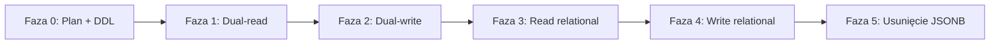
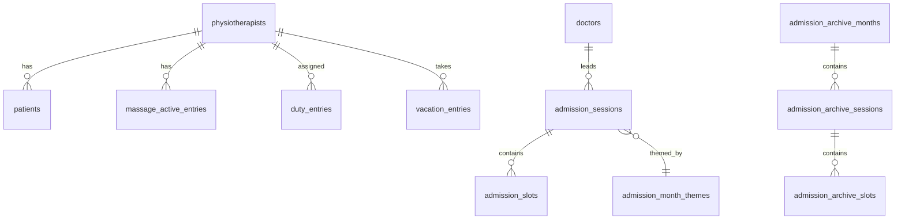

# Plan migracji: JSONB (`app_state.payload`) → model relacyjny

Branch: `plan/relational-db-schema`  
Data: 2026-07-23  
Status: **plan roboczy** (bez implementacji aplikacji)

---

## 1. Cel i zakres

### Obecny stan

- Jedna tabela `public.app_state` (`id`, `payload jsonb`, `updated_at`).
- Cały stan aplikacji (`AppData` w `src/lib/types.ts`) jest serializowany do jednego dokumentu JSON.
- API `/api/data`: odczyt/zapis całego dokumentu, optymistyczna kontrola wersji przez `updated_at` + 3-way merge po stronie klienta (`src/lib/app-data-merge.ts`, `DataContext.tsx`).
- Fallback lokalny: `data/app-data.json`.

### Docelowy stan

- Dane biznesowe w normalizowanych tabelach z kluczami obcymi, indeksami i ograniczeniami integralności.
- Metadane synchronizacji (wersja globalna) w osobnej tabeli — zachowanie semantyki „jedna wersja stanu aplikacji” na czas migracji.
- Repozytorium serwerowe składa `AppData` z JOIN-ów **albo** stopniowo przechodzi na granularne API (etap późniejszy).
- `app_state.payload` — tymczasowo jako snapshot/backup; usunięcie w ostatniej fazie.

### Poza zakresem (na tym etapie)

- Auth / multi-tenant (nadal single-tenant, `id = 'default'`).
- Zmiana UX sync (poll 8s) — chyba że konflikt wymusi innej strategii.
- Pełna refaktoryzacja frontendu poza warstwą danych.

---

## 2. Mapowanie encji `AppData` → tabele

Klucze `monthKey` = `YYYY-MM`, `yearKey` = `YYYY` (zgodnie z kodem aplikacji).

### 2.1 Słowniki / konfiguracja

| Encja TS | Tabela | Uwagi |
|----------|--------|--------|
| `Physiotherapist` | `physiotherapists` | `column_widths` → `jsonb` (rzadko queryowane) |
| `Doctor` | `doctors` | |
| `MassagesData.scheduleHours`, `headerNote` | `massage_settings` | wiersz singleton (`id = 'default'`) |
| `navOrder`, `navLabels` | kolumny w `app_settings` | `nav_order text[]`, `nav_labels jsonb` |
| `announcementsSeenAt` | `app_settings` | `timestamptz` |
| `admissionNotificationsSeenAt` | `app_settings` | `jsonb` (map physioId → ISO) |
| `admissionNotificationsReadIds` | `app_settings` | `jsonb` (map physioId → uuid[]) |
| `clinicClosedDays` | `clinic_closed_days` | `date` PK lub `(date)` unique |
| `autoArchiveSkip.*` | `auto_archive_skip` | `(domain, period_key)` PK; domain ∈ admissions/duties/vacations |

**Kolumny `physiotherapists`:**  
`id uuid PK`, `name`, `color`, `row_color`, `header_note`, `column_widths jsonb`, `sort_order int not null`.

**Kolumny `doctors`:**  
`id uuid PK`, `name`, `theme_id text`.

### 2.2 Dane bieżące (aktywne okresy)

| Encja TS | Tabela | Relacje |
|----------|--------|---------|
| `currentPatients[physioId]` | `patients` | FK → `physiotherapists`; `owner_physio_id` nullable FK |
| `massages.active[]` | `massage_active_entries` | FK → `physiotherapists` |
| `massages.waiting[]` | `massage_waiting_entries` | FK → `physiotherapists` |
| `duties[monthKey][]` | `duty_entries` | UNIQUE `(month_key, date)`; FK physio nullable |
| `admissions[monthKey][]` | `admission_sessions` + `admission_slots` | sesja 1:N sloty |
| `vacations[yearKey][]` | `vacation_entries` | UNIQUE `(year_key, date, physiotherapist_id)` |
| `admissionTableThemes[monthKey]` | `admission_month_themes` | PK `month_key` |

**`patients`:**  
`id uuid`, `physiotherapist_id uuid FK`, `sort_order`, `text`, `discharge_date date`, `discharge_date_manual bool`, `discharge_date_before_manual date`, `owner_physio_id uuid FK`.

**`admission_sessions`:**  
`id uuid`, `month_key char(7)`, `doctor_id uuid FK`, `admission_date date`, `planned_discharge_date date`, `planned_discharge_date_manual bool`, `sort_order`.

**`admission_slots`:**  
`id uuid`, `session_id uuid FK ON DELETE CASCADE`, `patient_name`, `admission_hour time`, `physiotherapist_id uuid FK`, `status text`, `linked_patient_id uuid FK nullable`, `sort_order`.

**`duty_entries`:**  
`month_key`, `date date`, `physiotherapist_id uuid FK nullable`.

**`vacation_entries`:**  
`year_key char(4)`, `date date`, `physiotherapist_id uuid FK`, `certainty text`.

### 2.3 Archiwa

| Encja TS | Tabele | Uwagi |
|----------|--------|--------|
| `admissionArchive[]` | `admission_archive_months`, `admission_archive_sessions`, `admission_archive_slots` | mirror struktury aktywnej + `archived_at` |
| `dutyArchive[]` | `duty_archive_months`, `duty_archive_entries` | |
| `vacationArchive[]` | `vacation_archive_years`, `vacation_archive_entries` | |
| `archive[]` (legacy) | `legacy_admission_archive_rows` | płaskie wiersze `Admission` |

Archiwum przyjęć: po przeniesieniu miesiąca do archiwum **usuwać** odpowiadające wiersze z tabel aktywnych (`admissions` / `admission_month_themes`) — zgodnie z obecną logiką aplikacji.

### 2.4 Ogłoszenia

| Encja TS | Tabela |
|----------|--------|
| `Announcement` | `announcements` |

**Kolumny:** `id`, `text`, `created_at`, `source`, `physiotherapist_id` FK nullable, `admission_link jsonb` nullable (monthKey, sessionId, slotId).

### 2.5 Metadane sync

| Cel | Tabela |
|-----|--------|
| Globalna wersja (zamiast `app_state.updated_at`) | `app_revision` |

**`app_revision`:**  
`id text PK default 'default'`, `updated_at timestamptz not null`, opcjonalnie `schema_version int`.

Trigger `BEFORE UPDATE` na tabelach mutujących **lub** jedna funkcja wywoływana z repozytorium po transakcji — musi aktualizować `app_revision.updated_at` atomowo z batch-em zmian.

---

## 3. Proponowany DDL (szkic)

Kolejność migracji SQL (nowy plik po `20260721183000_*`):

```
20260722100000_relational_schema.sql      -- CREATE TABLE, FK, indeksy, RLS
20260722101000_relational_backfill.sql    -- INSERT z app_state.payload (patrz §5)
20260722102000_app_revision.sql           -- app_revision + trigger touch (opcjonalnie)
```

Indeksy (minimum):

- `patients (physiotherapist_id, sort_order)`
- `admission_sessions (month_key, sort_order)`
- `admission_slots (session_id, sort_order)`
- `duty_entries (month_key, date)`
- `vacation_entries (year_key, date)`
- `announcements (created_at desc)`

RLS: jak dziś — brak polityk dla anon/authenticated; dostęp tylko service role z Next.js.

---

## 4. Strategia migracji aplikacji (fazy)



| Faza | Opis | Ryzyko |
|------|------|--------|
| **0** | Branch, plan, szkic DDL, generator backfill | niskie |
| **1** | Po deploy DDL: backfill z istniejącego `payload`; walidacja liczności rekordów | niskie |
| **2** | `loadAppData`: składanie z SQL; porównanie z JSON (dev flag); log rozbieżności | średnie |
| **3** | `saveAppData`: zapis transakcyjny do tabel + nadal aktualizacja `payload` (dual-write) | średnie |
| **4** | API nadal przyjmuje/zwraca `AppData` — **bez zmiany frontendu** | — |
| **5** | Wyłączenie zapisu do `payload`; odczyt tylko SQL | średnie |
| **6** | Usunięcie kolumny `payload` / tabeli `app_state` lub zostawienie pustego wiersza metadanych | niskie |

Feature flag (env): `DATA_STORAGE=jsonb|relational|dual` — przełączanie bez redeploy schematu.

---

## 5. Backfill danych z JSONB

### 5.1 Skrypt

- **`scripts/backfill-relational-from-jsonb.mjs`** (do implementacji) — czyta `app_state.payload` lub `data/app-data.json`, emituje SQL albo wywołuje Supabase RPC.
- Istniejący **`scripts/generate-seed-migration.mjs`** — po migracji generować seed z tabel relacyjnych, nie z monolitu JSON.

### 5.2 Kolejność INSERT (respekt FK)

1. `app_settings`, `massage_settings`
2. `physiotherapists`, `doctors`
3. `patients`, `massage_*`, `clinic_closed_days`, `auto_archive_skip`
4. `admission_month_themes`, `admission_sessions`, `admission_slots`
5. `duty_entries`, `vacation_entries`
6. Tabele archiwów (analogicznie)
7. `announcements`
8. `app_revision.updated_at` ← `app_state.updated_at`

### 5.3 Walidacja po backfill

Automatyczny test (Node):

- Round-trip: `AppData` z JSON vs `assembleAppDataFromDb()` — deep equal po normalizacji (sortowanie kluczy, daty).
- Liczniki: liczba fizjo, sesji per monthKey, slotów, wpisów dyżurów.
- Przykładowe reguły biznesowe: unikalność `(month_key, date)` w dyżurach.

---

## 6. Sync i konflikty (krytyczna zmiana architektury)

### Dziś

- Cały dokument + `updated_at` wiersza.
- Konflikt 409 → merge 3-way w przeglądarce.

### Po migracji (propozycja etapowa)

**Etap A (minimalny diff, zalecany na start):**  
Bez zmiany API — nadal jeden PUT całego `AppData`. Serwer:

1. Otwiera transakcję.
2. Sprawdza `app_revision.updated_at = baseUpdatedAt`.
3. DELETE + INSERT (lub UPSERT) wszystkich tabel z payloadu klienta.
4. Commit + nowy `updated_at`.

Minus: kosztowny zapis, ale **zachowuje obecny merge po stronie klienta**.

**Etap B (opcjonalny, później):**  
Granularne wersjonowanie (np. `entity_versions` lub `updated_at` per tabela) + merge per encja — wymaga przepisania `app-data-merge.ts` i ewentualnie API.

Rekomendacja: **Etap A** do momentu stabilizacji; Etap B tylko jeśli wąskie gardło wydajności lub częste konflikty.

---

## 7. Warstwa kodu — pliki do zmiany

| Plik | Zmiana |
|------|--------|
| `src/lib/supabase/app-data-repository.ts` | Odczyt/zapis relacyjny, transakcje |
| `src/lib/supabase/database.types.ts` | Regeneracja z Supabase CLI |
| `src/lib/data-store.ts` | Fallback JSON bez zmian na Fazę 4 |
| `src/app/api/data/route.ts` | Bez zmian kontraktu HTTP (Faza 4) |
| `src/lib/app-data-merge.ts` | Bez zmian (Etap A) |
| `src/context/DataContext.tsx` | Bez zmian (Etap A) |
| Nowy: `src/lib/supabase/app-data-assembler.ts` | SQL → `AppData` |
| Nowy: `src/lib/supabase/app-data-persister.ts` | `AppData` → SQL |
| Testy: `src/lib/supabase/__tests__/roundtrip.test.ts` | Round-trip |

---

## 8. Seed lokalny i migracje Supabase

- Plik `20260721183000_seed_local_app_data.sql` (1899 linii JSON w `payload`) — **przestarzały** po Fazie 1.
- Docelowo: seed generowany z relacyjnych INSERT-ów albo `supabase db seed` z podzielonymi plikami per domena.
- Kolejność timestampów migracji: nowe pliki **po** seed JSON, z backfill migrującym istniejący stan.

---

## 9. Ryzyka i mitigacja

| Ryzyko | Mitigacja |
|--------|-----------|
| Rozbieżność dual-read JSON vs SQL | Flag `dual`, log diff, testy round-trip w CI |
| Utrata danych przy DELETE+INSERT w transakcji | Transakcja Postgres; backup `payload` do Fazy 5 |
| Długi lock przy dużym PUT | Etap A akceptowalny przy single-tenant; później batch UPSERT |
| FK violations przy niepełnych danych | Backfill + CHECK; sanity w `sanitizeAppData` przed zapisem |
| Ręczne edycje w Supabase Dashboard | Tylko service role; dokumentacja operacyjna |

---

## 10. Kryteria ukończenia migracji

- [ ] Wszystkie tabele z §2 istnieją w produkcji.
- [ ] Backfill wykonany; walidacja liczników OK.
- [ ] `loadAppDataFromSupabase` czyta wyłącznie z SQL.
- [ ] `saveAppDataToSupabaseVersioned` zapisuje wyłącznie do SQL + `app_revision`.
- [ ] Test round-trip + smoke test UI (przyjęcia, dyżury, urlopy, archiwum, undo/redo).
- [ ] `app_state.payload` usunięte lub zamrożone (read-only backup).
- [ ] README / komentarz w migracji z opisem `DATA_STORAGE`.

---

## 11. Następne kroki na branchu (implementacja)

1. Dodać migrację `20260722100000_relational_schema.sql` (pełny DDL z §3).
2. Napisać `app-data-assembler.ts` + `app-data-persister.ts` (mapowanie 1:1 z typami TS).
3. Skrypt backfill + test round-trip.
4. Podpiąć feature flag w repozytorium.
5. PR z planem + DDL + szkieletem kodu (bez włączania relacyjnego w prod domyślnie).

---

## Załącznik A — diagram ER (uproszczony)



---

## Załącznik B — odniesienia w repo

- Typy: `src/lib/types.ts` (`AppData`, linie 142–179)
- Obecna migracja: `supabase/migrations/20260721120000_initial_app_state.sql`
- Repozytorium: `src/lib/supabase/app-data-repository.ts`
- Merge: `src/lib/app-data-merge.ts`
